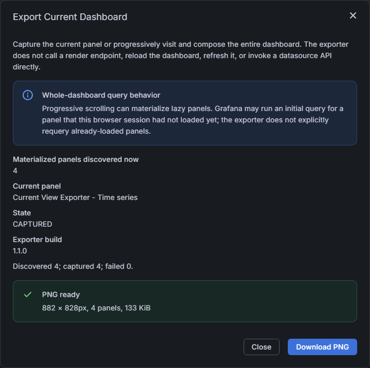

# Grafana Current View Exporter

[](https://github.com/digitalrcs/grafana-current-view-exporter/actions/workflows/ci.yml)
[](https://github.com/digitalrcs/grafana-current-view-exporter/actions/workflows/release.yml)
[](LICENSE)

`digitalrcs-currentviewexporter-app` is a browser-local Grafana App Plugin that exports the dashboard currently shown in the user's existing Grafana session as a PNG.

Its defining constraint is simple: capture the visual state Grafana already rendered. The exporter does not call Grafana render endpoints, reload the dashboard, refresh it, or invoke datasource APIs directly merely to create an image.



## Features

- **Current panel PNG** captures one already-rendered panel.
- **Entire dashboard PNG** progressively visits the dashboard, captures materialized panels, preserves their measured layout, and restores the original scroll position.
- Prefers Grafana's panel screenshot service when available, with an isolated `html-to-image` fallback.
- Keeps intermediate snapshots as compressed PNG `Blob` objects.
- Downscales oversized dashboards to conservative browser-canvas limits instead of crashing the page.
- Continues after an individual panel failure and reports captured/failed counts.
- Runs entirely in the browser with no backend, telemetry, cloud upload, CDN, or external rendering service.

## Query-safety model

Capturing an already-rendered panel is E2E-tested to produce zero `/api/ds/query` requests at the capture-button boundary.

Whole-dashboard capture can scroll a lazy panel into view. Grafana may then perform that panel's normal **initial** query. The exporter does not explicitly request that query and does not claim it can prevent every Grafana version or third-party panel from requerying when a component remounts. See [Architecture](docs/ARCHITECTURE.md) for the exact boundary.

## Compatibility

- Grafana `>=12.4.0 <14.0.0`
- Node.js 22+ for development
- Modern browsers supported by Grafana; current E2E coverage uses Chromium
- Grafana 13 scenes dashboards prefer `getPanelScreenshotService()`
- Grafana 12.4 and unsupported panels use the isolated DOM fallback

See [Compatibility](docs/COMPATIBILITY.md) for tested behavior and limitations.

## Installation

### Grafana catalog

After Grafana approves the Community plugin submission, install **Grafana Current View Exporter** from the Grafana plugin catalog and enable the app for the organization.

### Review or development build

The first-review archive is unsigned by design. Unsigned plugins should only be loaded in a development/review Grafana instance that explicitly allowlists `digitalrcs-currentviewexporter-app`.

```bash
npm ci
npm run build
docker compose up --build
```

Open <http://localhost:3005>, sign in with `admin` / `admin`, and open **Dashboards > Current View Exporter Review**. The repository provisions built-in Grafana TestData, the review dashboard, and the enabled app.

See [Installation](docs/INSTALLATION.md) for packaged ZIP and container instructions.

## Use

1. Open a dashboard and wait for the panels you care about to finish rendering.
2. Open any panel menu.
3. Choose **Extensions > Export current dashboard**.
4. Select **Capture current panel** or **Capture entire dashboard**.
5. Download the PNG when the state reaches `CAPTURED`.

## Development

```bash
npm ci
npm run typecheck
npm run lint
npm run test:ci
npm run build
docker compose up --build -d
npm run e2e
```

The production build and release workflows are generated from Grafana's official `create-plugin` scaffold. The tag-based release workflow creates the correctly structured ZIP and provenance attestation.

## Documentation

- [Architecture and query-safety decisions](docs/ARCHITECTURE.md)
- [Installation](docs/INSTALLATION.md)
- [Compatibility](docs/COMPATIBILITY.md)
- [Grafana reviewer guide](docs/REVIEW_GUIDE.md)
- [Catalog submission and signing](docs/CATALOG_SUBMISSION.md)
- [Troubleshooting](docs/TROUBLESHOOTING.md)
- [Contributing](CONTRIBUTING.md)
- [Security policy](SECURITY.md)
- [GitHub Wiki](https://github.com/digitalrcs/grafana-current-view-exporter/wiki)

## Current limitations

- PNG only. JPEG and PDF are planned but are not advertised as implemented.
- WebGL correctness depends on Grafana's screenshot service or a panel-provided screenshot override; arbitrary third-party WebGL output cannot yet be guaranteed.
- Auto-refresh is not paused because no supported cross-version API has been adopted. Avoid exporting during a scheduled refresh if strict consistency is required.
- The supported public entry point is the dashboard panel menu; Grafana currently has no equivalent published dashboard-toolbar extension point used by this plugin.

## Privacy and security

All dashboard capture and image generation occurs locally in the user's browser. No dashboard data is transmitted to an external rendering service by this plugin.

Dashboard images can contain sensitive information. Handle downloaded files according to your organization's data policy.

## License

Apache-2.0. Copyright 2026 DigitalRCS.
