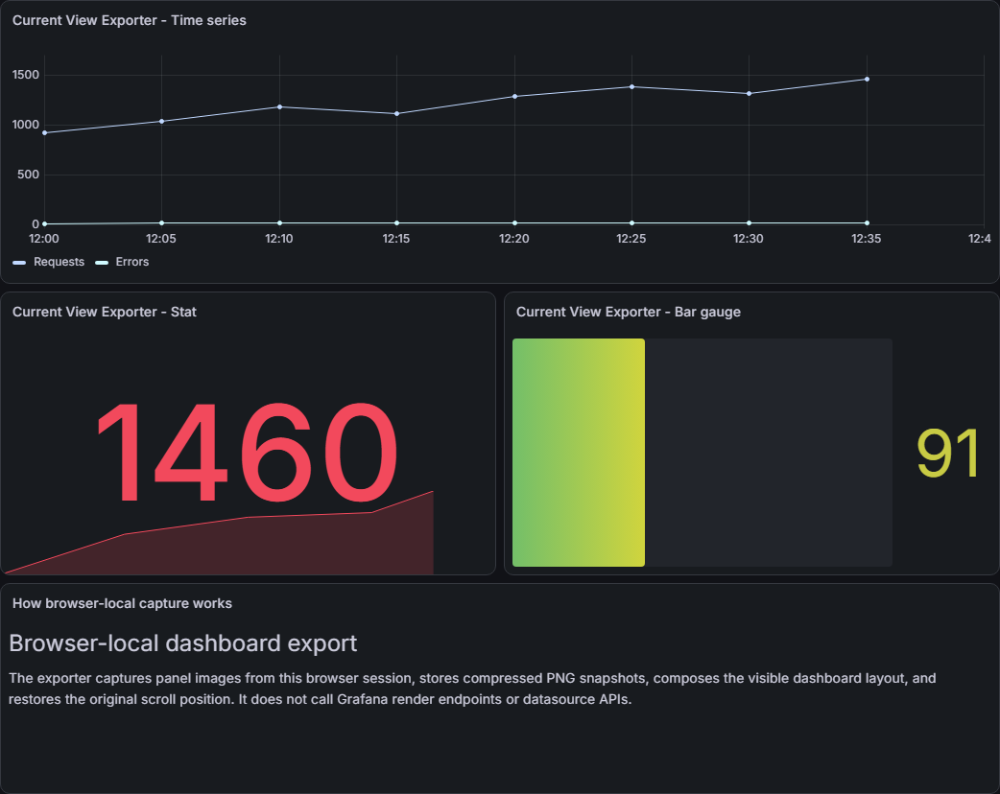
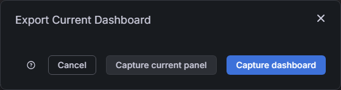
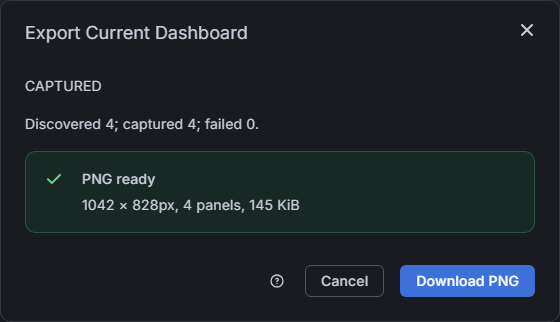

# Grafana Current View Exporter

Turn the dashboard you are viewing into a shareable PNG, directly from your Grafana browser session. Export one panel or combine the dashboard's panels into a single image without setting up a separate rendering service.

Use it to capture an investigation, attach visual evidence to a support ticket, prepare a presentation, or share a dashboard view during a handover. The result is an image of the rendered panels, not a data export or an interactive dashboard.

## See the result



An actual PNG downloaded with **Capture dashboard**, using the included reviewer dashboard and Grafana's built-in TestData source. The example data is illustrative. No additional DigitalRCS panels, AI provider, or external data service is required.

## Key capabilities

- **Capture one panel or the dashboard:** choose the scope from the same compact dialog.
- **Use your current browser session:** capture panels after selecting the time range, variables, and visible state you want to share.
- **Include panels below the fold:** dashboard capture progressively scrolls to discover and capture more panels, then restores your original scroll position.
- **Keep the panel arrangement:** combine captured panels into one PNG using their measured dashboard positions.
- **Review the outcome:** see captured and failed panel counts, cancel an active capture, and check warnings before downloading.
- **Export locally:** image capture and composition run in the browser, with no exporter backend or external rendering service.

## Requirements and installation

The plugin requires **Grafana 12.4 or later** and a browser supported by your Grafana version. Automated browser tests use Chromium.

This is an **app plugin**, not a visualization or data source. After your Grafana administrator installs **Grafana Current View Exporter**, enable the app for the organization. You do not need to add a new panel, configure another data source, create an exporter account, or install an image-renderer service.

Open a dashboard you already have permission to view. The exporter works with that browser session; it does not grant access to other dashboards or data.

See the [installation guide](https://github.com/digitalrcs/grafana-current-view-exporter/blob/main/docs/INSTALLATION.md) for deployment details and the separate unsigned review/development setup.

## Export a panel or dashboard

1. Open your dashboard and choose the time range and variables.
2. Expand the sections you want to include and wait for charts, tables, and other panel content to finish rendering.
3. Open a panel's menu and select **Extensions → Export current dashboard**.
4. Choose **Capture current panel** for that panel, or **Capture dashboard** for the dashboard's panels. Select **Help** for behavior and status details.
5. When **PNG ready** appears, check any warnings and select **Download PNG**.



Choose the capture scope without leaving the dashboard. During capture, **Cancel capture** stops the operation; dashboard capture restores the original scroll position.

### Check the result before sharing



The dashboard completion dialog reports the image dimensions, captured panel count, and any warnings. A failed panel does not stop the remaining panels from being captured, so a completed image can still be partial. Open the downloaded PNG and confirm that the panels and text you need are present.

The filename is based on the selected panel or dashboard title. The screenshots above show the export controls and completion state; the first image on this page is the downloaded PNG itself.

## How capture behaves

**Current-panel capture** uses the selected panel's rendered content. **Dashboard capture** scrolls through the dashboard, captures panels as they become available, and combines their images into one PNG.

The exporter does not call Grafana render endpoints, reload the dashboard, request a refresh, or invoke data source APIs directly. This avoids deliberately starting a separate dashboard-rendering session just to create an image.

It is not a guarantee of zero network traffic or a single instant in time. Grafana can run a panel's normal initial query when scrolling brings a previously unloaded panel into view. Scheduled refreshes, live data, and third-party panel behavior can also change content during capture.

For a more consistent image, let panels settle and manually turn off automatic refresh while exporting, if appropriate for your workflow. The exporter does not pause refresh for you.

## What is included in the PNG?

The dashboard image contains the **captured panel areas and their layout**. It does not add Grafana's navigation, dashboard heading, variable controls, or time picker around the panels.

Capture reflects the content rendered inside each panel. It does not expand collapsed rows, visit other dashboard tabs, advance a table's pagination, or export underlying query rows. Before capturing, expand the desired sections and make important content visible. Enlarge panels when long text or internal scrollbars would otherwise hide part of the result.

## Compatibility and limitations

- **PNG output only.** There is no PDF, JPEG, scheduled report, or server-side export workflow.
- **Panel rendering matters.** The plugin uses Grafana's panel screenshot service when available, with a DOM-based fallback. Some third-party panels, WebGL content, cross-origin images, or custom fonts may not capture as expected.
- **Large dashboards may be reduced in size.** Final images are automatically downscaled when they exceed the composer's browser-canvas limits. A warning identifies that reduction; available browser memory still matters.
- **Capture is progressive, not atomic.** Different panels can be captured at different moments. Inspect the result when working with rapidly changing data.
- **A successful download is not a visual-quality guarantee.** Always inspect exported images before using them in a report.

See [compatibility and limitations](https://github.com/digitalrcs/grafana-current-view-exporter/blob/main/docs/COMPATIBILITY.md) and [troubleshooting](https://github.com/digitalrcs/grafana-current-view-exporter/blob/main/docs/TROUBLESHOOTING.md) for more detail.

## Privacy

Captured panel images are processed and composed in your browser. This plugin has no backend or telemetry and does not upload captured images to an external rendering service.

Normal Grafana, data source, and panel-asset requests can still occur. Browser-local image generation does not make the dashboard offline. Downloaded PNGs may contain sensitive information; review them and follow your organization's sharing policy.

## Documentation and support

- [User guide](https://github.com/digitalrcs/grafana-current-view-exporter/wiki/Using-the-Exporter)
- [Installation](https://github.com/digitalrcs/grafana-current-view-exporter/blob/main/docs/INSTALLATION.md)
- [Query safety and lazy panels](https://github.com/digitalrcs/grafana-current-view-exporter/wiki/Query-Safety-and-Lazy-Panels)
- [Troubleshooting](https://github.com/digitalrcs/grafana-current-view-exporter/blob/main/docs/TROUBLESHOOTING.md)
- [Source code and releases](https://github.com/digitalrcs/grafana-current-view-exporter)
- [Report an issue](https://github.com/digitalrcs/grafana-current-view-exporter/issues)

When reporting a capture problem, include your Grafana version, plugin version, browser, panel type, and any capture warning. Remove credentials and sensitive dashboard content from reports and screenshots.

## License

Apache-2.0. Developed by [DigitalRCS](https://www.digitalrcs.com).

## Development and review environment

[](https://github.com/digitalrcs/grafana-current-view-exporter/actions/workflows/ci.yml)
[](https://github.com/digitalrcs/grafana-current-view-exporter/actions/workflows/release.yml)

Plugin ID: `digitalrcs-currentviewexporter-app`. Node.js 22+ is required for development, not for end users installing the packaged app.

```bash
npm ci
npm run typecheck
npm run lint
npm run test:ci
npm run build
```

For the self-contained reviewer environment, run `docker compose up --build -d` from this repository, open <http://localhost:3005>, and sign in with `admin` / `admin`. It provisions the enabled app, Grafana TestData, and **Current View Exporter Review**. Run `npm run e2e` against that instance. These unsigned builds and demo credentials are for isolated development/review only.

On the DigitalRCS development PC, use the existing shared demo stack on port 3001 instead of starting an additional Grafana instance. The `npm run server` convenience command targets that shared stack. See its README for startup and rebuild instructions.

The packaged catalog description comes from **`src/README.md`**, not this root README. Keep the user-facing sections aligned. Screenshots referenced by `src/plugin.json` are bundled into the plugin archive.

### Maintainer documentation

- [Architecture and query-safety decisions](docs/ARCHITECTURE.md)
- [Compatibility and limitations](docs/COMPATIBILITY.md)
- [Grafana reviewer guide](docs/REVIEW_GUIDE.md)
- [Catalog submission and signing](docs/CATALOG_SUBMISSION.md)
- [Contributing](CONTRIBUTING.md)
- [Security policy](SECURITY.md)
- [GitHub Wiki](https://github.com/digitalrcs/grafana-current-view-exporter/wiki)

The tag-based GitHub release workflow builds the plugin ZIP with provenance attestation. Catalog README changes must be included in a **new versioned archive** and sent through **Update submission** on the existing Grafana submission; changing the README on GitHub alone does not replace the archive already under review.
